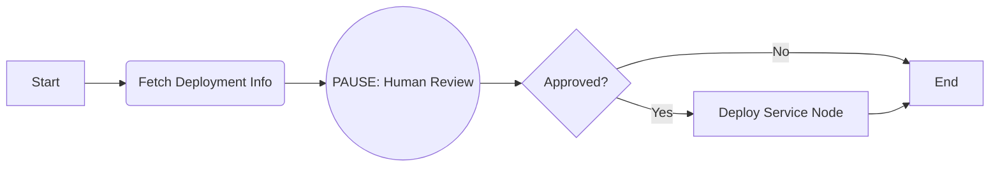
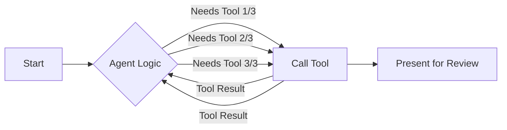
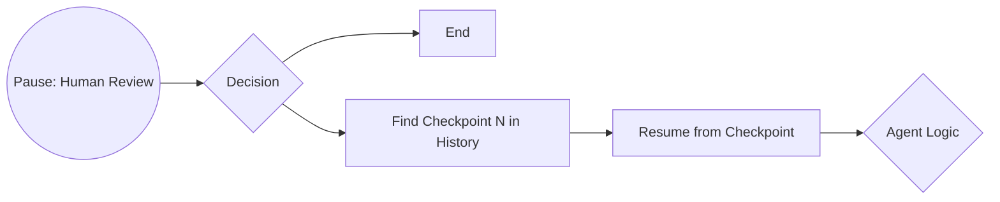
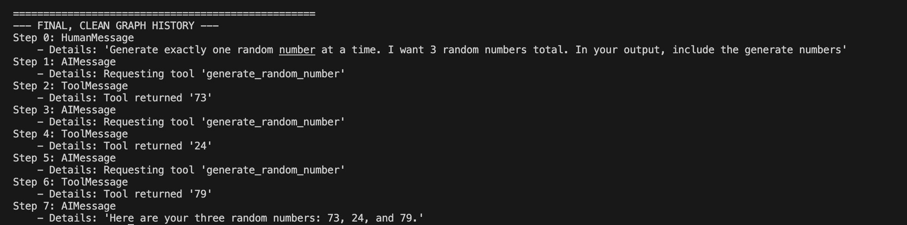

# Advanced State Management: Beyond Just Messages

So far, our agent's state has been a simple list of messages. LangGraph's `add_messages` helper has cleverly managed the conversation history for us. But what happens when we need to track more than just the chat? What if we need to store structured data, track approvals, or manage complex application states?

This is where LangGraph's state management truly shines. The state `TypedDict` can hold anything you want, giving you a powerful way to control the agent's flow. In this tutorial, we'll explore two advanced techniques:

1.  **Customizing the state** to manage an approval workflow.
2.  **Time travel**, allowing us to rewind the agent's state to correct its course.

## Customizing and Updating State: An Approval Workflow

Imagine an agent designed to help with software deployments. It needs to fetch deployment details, present them for human review, and only proceed if a human approver gives the green light. A simple list of messages won't be enough to track the approval status.

We need a richer state object.

### 1. Defining a Custom State

Let's create a new `State` dictionary that includes not only our messages but also fields for the deployment information and the approval status.

```python
from typing import TypedDict, Annotated, Optional
from langchain_core.messages import BaseMessage

# We can define a structure for our deployment info
class DeploymentInfo(TypedDict):
    build_number: int
    changelog: str
    deployed_by: Optional[str]
    deployed_at: Optional[str]

class State(TypedDict):
    messages: Annotated[list, add_messages]
    # A new field to hold our structured data
    deployment_info: Optional[DeploymentInfo]
    # A simple flag to track the approval status
    approved: bool
```
Our state now has a dedicated place for `deployment_info` and a boolean `approved` flag, which we'll initialize to `False`.

### 2. The Approval Flow

Our new workflow will look like this:

1.  Fetch deployment information and add it to the state.
2.  Interrupt and present this information to a human.
3.  The human either approves or denies the deployment.
4.  Based on the approval, the graph will branch to either a "deploy" node or the end.




### 3. Updating the State from Outside the Graph

The key to this workflow is updating the state *after* the graph has been interrupted. When the human reviewer gives their approval, our application code will directly modify the graph's state using `graph.update_state()`.

Here’s how we can implement this:

1.  **New Nodes**: We'll define a `fetch_deployment_info` node that simulates getting data and a `deploy_service` node that runs after approval.
2.  **Conditional Edge**: We'll create a new function `check_approval_status` that inspects `state['approved']` to decide the next step.
3.  **Application Logic**: The main script will get user input and call `graph.update_state()` to change the `approved` flag from `False` to `True`.

Here's a look at the application logic that handles the human interaction:

```python
# The graph will interrupt before the 'check_approval_status' edge
# ... graph execution starts ...
paused_state = graph.get_state(config)
info = paused_state.values['deployment_info']
print("--- Deployment Review Required ---")
print(f"Build Number: {info['build_number']}")
print(f"Changelog: {info['changelog']}")

approval = input("Approve deployment? (yes/no): ").lower()

if approval == "yes":
    # If approved, UPDATE THE STATE
    update = {"approved": True}
    graph.update_state(config, update)
    # Resume the graph
    graph.invoke(None, config)
else:
    print("Deployment aborted.")
```
This pattern is incredibly powerful. It allows the graph to handle the automated parts of a workflow while giving the user precise control over key decision points.

---

## Customizing and Resetting State: The Time Travel Approach


### Scenario: The random number generation 

To make the concept of time travel crystal clear, we'll use a simple, deterministic task. Imagine an agent designed to follow a multi-step plan:

1.  The user asks the agent to generate **three random numbers**, one at a time.
2.  The agent calls a `generate_random_number` tool three separate times, adding each result to the conversation state.
3.  After generating all three numbers, the agent presents the final list to the user.
4.  The graph **pauses** for human review.
5.  The user can either tell the agent to **rewind** to a previous step (e.g., "start over from the 2nd number") or proceed with the generated numbers.
6.  If a rewind is requested, the application code will find the correct checkpoint in the graph's history, roll back the state, and let the agent continue from that exact point.

### Visualizing the Time Travel Workflow

<!-- ??? "Time Travel Flow" -->






### The Key Ingredients for Time Travel

This advanced pattern relies on a few core LangGraph features working together.

!!! info "A Persistent Checkpointer is Essential"
    Time travel is only possible because a **checkpointer** saves the state of the graph after every single step. For this to work, you *must* compile your graph with a checkpointer like `MemorySaver` or, for production apps, `SqliteSaver`. It's this saved history that we will navigate.

Here are the key components of our implementation:

<div class="grid cards" markdown>

-   **Multi-Step Task**
    Our prompt explicitly asks the agent to generate three numbers one at a time. This forces the agent to call its tool multiple times, creating a distinct history of checkpoints that we can later choose from.

-   **`graph.get_state_history()`**
    This is our time machine. After the graph pauses, we can call this method to retrieve a complete, ordered list of every state the graph has been in for the current conversation thread.

-   **Application-Side Logic**
    The graph itself doesn't contain the "rewind" logic. The intelligence to inspect the history, select a checkpoint, and resume the graph lives in our Python application. This separates the agent's automated workflow from the user's manual control.

</div>

### Building the Time-Traveling Agent


#### 1. The Tool and State

First, we define our simple tool and the graph's state. The state itself remains a simple list of messages; the complexity lies in how we manage its history.

```python
import random
from langchain_core.tools import tool
from typing import TypedDict, Annotated
from langgraph.graph.message import add_messages

# A simple tool that generates a number
@tool
def generate_random_number(min_val: int = 1, max_val: int = 100) -> int:
    """Generates a random number within a specified range."""
    print(f"--- TOOL CALL: Generating a random number ---")
    return random.randint(min_val, max_val)

# The state remains simple
class State(TypedDict):
    messages: Annotated[list, add_messages]
```

#### 2. The Time Travel Cockpit

The core of our solution is the application logic that runs after the graph pauses/interrupts for the human review:

1.  Getting the current state of the paused graph.
2.  Presenting the agent's work to the user.
3.  Handling user feedback (a number to rewind to state before that number was generated).
4.  **Executing the time travel:**
    *   Fetching the entire history of checkpoints.
    *   Finding the specific checkpoint to rewind to by counting the `ToolMessage` instances.
    *   Creating a new configuration and resuming the graph's execution from that past state.

Let's look at the logic for finding the right checkpoint:

```python
# 'choice' is the step the user wants to rewind to (e.g., 2)
current_history = list(graph.get_state_history(config))

# We iterate through the checkpoints to find the one
# that occurred just *before* the chosen tool call.
target_checkpoint = None
for state in reversed(current_history):
    tool_messages = [msg for msg in state.values['messages'] if isinstance(msg, ToolMessage)]
    print(f"Checking checkpoint: {len(tool_messages)} tool messages")
    
    if len(tool_messages) == choice - 1:
        target_checkpoint = state
        print(f"Found target checkpoint with {len(tool_messages)} tool messages")
        break

if target_checkpoint:
    print(f"Rewinding to checkpoint with {len([msg for msg in target_checkpoint.values['messages'] if isinstance(msg, ToolMessage)])} tool messages")
    print(f"Target checkpoint config: {target_checkpoint.config}")
    print("=== RESUMING FROM CHECKPOINT ===")
    
    for event in graph.stream(None, target_checkpoint.config):
        print(f"Event: {event}")

    final_state = graph.get_state(config).values
```

This ability to programmatically search the agent's memory and restart its "thought process" from a specific point is what makes this technique so powerful.

### Full Code Example

??? "Full Code"
    ```python title="agent_with_state_management.py" hl_lines="71 85 97-100 106-109"
    import os
    import random
    from typing import Annotated, TypedDict

    from dotenv import load_dotenv
    from langchain_core.messages import AIMessage, HumanMessage, ToolMessage
    from langchain_core.tools import tool
    from langchain_google_genai import ChatGoogleGenerativeAI
    from langgraph.graph import StateGraph, END, START
    from langgraph.graph.message import add_messages
    from langgraph.prebuilt import ToolNode, tools_condition
    from langgraph.checkpoint.memory import MemorySaver

    # --- 1. Define our tool ---
    @tool
    def generate_random_number(min_val: int = 1, max_val: int = 100) -> int:
        """Generates a random number within a specified range."""
        print(f"--- TOOL CALL: Generating a random number ---")
        return random.randint(min_val, max_val)

    # --- 2. Define a State ---
    class State(TypedDict):
        messages: Annotated[list, add_messages]

    # --- Setup LLM and Tools ---
    load_dotenv()
    llm = ChatGoogleGenerativeAI(model="gemini-2.5-flash") 
    tools = [generate_random_number]
    llm_with_tools = llm.bind_tools(tools)

    # --- Define Graph Nodes ---
    def chatbot(state: State):
        print("--- CHATBOT: Deciding next action ---")
        return {"messages": [llm_with_tools.invoke(state["messages"])]}

    tool_node = ToolNode(tools)

    # --- Assemble the Graph ---
    graph_builder = StateGraph(State)
    graph_builder.add_node("chatbot", chatbot)
    graph_builder.add_node("tools", tool_node)
    graph_builder.add_node("human_review", lambda state: state)

    graph_builder.add_edge(START, "chatbot")
    graph_builder.add_conditional_edges("chatbot", tools_condition, {"tools": "tools", END: "human_review"})
    graph_builder.add_edge("tools", "chatbot")
    graph_builder.add_edge("human_review", END)

    # --- Compile and Run ---
    memory = MemorySaver()
    graph = graph_builder.compile(
        checkpointer=memory,
        interrupt_before=["human_review"],
    )

    # Use a consistent config throughout
    config = {"configurable": {"thread_id": "rn-game"}}
    user_input = "Generate exactly one random number at a time. I want 3 random numbers total. In your output, include the generate numbers"
    initial_state = {"messages": [HumanMessage(content=user_input)]}

    # Initial run
    print("=== INITIAL RUN ===")
    for event in graph.stream(initial_state, config):
        print(f"Event: {event}")

    final_state = None

    # --- Asking User to rewind to desired state in graph by choosing a number n (1/2/3), by resetting the graph to state before the nth number generation---
    while True:
        # Get current state - this is always the latest state
        current_state = graph.get_state(config)
        
        print("\n--- HUMAN REVIEW ---")
        print("Agent's message:")
        print(current_state.values["messages"][-1].content)
        
        feedback = input("Type a number to rewind to stage before nth random number generation or press Enter to proceed as it is: ").lower()

        try:
            choice = int(feedback)
            if 1 <= choice <= 3:
                print(f"Rewinding to re-generate from step {choice}...")
                
                # Get the CURRENT state history
                current_history = list(graph.get_state_history(config))
                
                print(f"Current history has {len(current_history)} checkpoints")
                
                # Find the checkpoint that has exactly (choice - 1) tool messages
                target_checkpoint = None
                
                # Process in chronological order to find the right checkpoint
                for state in reversed(current_history):
                    tool_messages = [msg for msg in state.values['messages'] if isinstance(msg, ToolMessage)]
                    print(f"Checking checkpoint: {len(tool_messages)} tool messages")
                    
                    if len(tool_messages) == choice - 1:
                        target_checkpoint = state
                        print(f"Found target checkpoint with {len(tool_messages)} tool messages")
                        break
                
                if target_checkpoint:
                    print(f"Rewinding to checkpoint with {len([msg for msg in target_checkpoint.values['messages'] if isinstance(msg, ToolMessage)])} tool messages")
                    print(f"Target checkpoint config: {target_checkpoint.config}")
                    
                    print("=== RESUMING FROM CHECKPOINT ===")
                    
                    for event in graph.stream(None, target_checkpoint.config):
                        print(f"Event: {event}")
                    

                    final_state = graph.get_state(config).values

                    print("Checkpoint resume completed.")
                    break
                else:
                    print("Could not find the specified checkpoint.")
                    print("Available checkpoints in current history:")
                    for i, state in enumerate(reversed(current_history)):
                        tool_messages = [msg for msg in state.values['messages'] if isinstance(msg, ToolMessage)]
                        print(f"  Checkpoint {i}: {len(tool_messages)} tool messages")
            else:
                print("Invalid number. Please enter 1, 2, or 3.")
        except Exception as e:
            final_state = current_state.values
            print("No reset performed. Either a number was not provided or reset was not needed.")
            break


    if final_state:
        debug_state = final_state
    else:
        debug_state = current_state

    ## State Inspection
    print("\n" + "="*50)
    print("--- FINAL, CLEAN GRAPH HISTORY ---")
    for i, message in enumerate(final_state['messages']):
        msg_type = message.__class__.__name__
        print(f"Step {i}: {msg_type}")
        if isinstance(message, AIMessage) and message.tool_calls:
            print(f"    - Details: Requesting tool '{message.tool_calls[0]['name']}'")
        elif isinstance(message, ToolMessage):
            print(f"    - Details: Tool returned '{message.content}'")
        else:
            print(f"    - Details: '{message.content}'")
    ```
If we check the final state history, it won't have any trace of any reset and will render as first time random numbers being output. This demonstration shows how we can ask agent to travel back in time.
