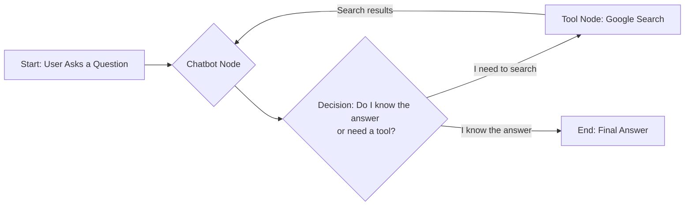
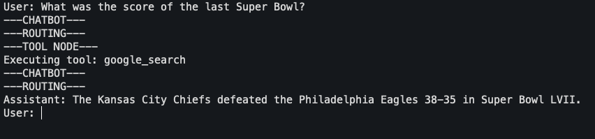

# Agent 007

Our objective is to build a foundational AI agent using LangGraph. This won't be just any chatbot; this agent will have the ability to think, and when it hits a wall, it will be resourceful. It will have a special gadget: **Google Search**.

## 0. The Agent Loop

Before we write a single line of code, let's understand the plan. Our agent will operate in a loop, a cycle of thought and action. Here’s a high-level look at its operational flow:



This loop is the essence of most modern agents. The agent receives a prompt, thinks about it, decides if it needs to use a tool, uses it, re-evaluates with the new information, and finally responds. LangGraph makes defining this flow incredibly intuitive.

Let's get to it. Create a new file named `agent-007.py` in the project directory.

## 1. The Gadgets: Imports and Setup

Every good agent needs their gadgets. In our case, these are the Python libraries and initial setup required to connect to our services.

```python title="agent-007.py"
import os
import json
from typing import Annotated, TypedDict

from dotenv import load_dotenv
from langchain_core.messages import ToolMessage
from langchain_core.tools import Tool
from langchain_google_community import GoogleSearchAPIWrapper
from langchain_google_genai import ChatGoogleGenerativeAI
from langgraph.graph import StateGraph, END, START
from langgraph.graph.message import add_messages

# Load environment variables from .env
load_dotenv()

# We will set the GOOGLE_API_KEY and GOOGLE_CSE_ID
# in the .env file
```
We're importing everything we need upfront. Notice `load_dotenv()`, which securely loads the keys we saved in the `.env` file during our setup phase.

## 2. The Dossier: Defining the Agent's State

An agent needs a way to keep track of the conversation and its own internal thoughts. In LangGraph, this is managed through a **State** object. Think of it as the agent's short-term memory or a dossier that gets updated with new intel at each step.

We'll define our state as a simple dictionary with a single key, `messages`.

```python title="agent-007.py"
# ... (imports and setup)

class State(TypedDict):
    """
    Represents the state of our agent.

    Attributes:
        messages: A list of messages that is dynamically updated.
                  The `add_messages` function ensures that new messages are
                  appended to the list, rather than replacing it.
    """
    messages: Annotated[list, add_messages]

```

The `add_messages` helper is a neat little function from LangGraph. It ensures that when a node returns a list of messages, they are *added* to the existing list in the state, not overwriting it. This is how we maintain the conversation history.

## 3. The Brain: The LLM and the Chatbot Node

The heart of our agent is the LLM. We'll use Google's `gemini-2.0-flash`, a fast and highly capable model. Then, we'll create our first **node**, the "chatbot" node, which is responsible for calling the LLM.

```python title="agent-007.py"
# ... (after State class)

# 1. Define the primary LLM
# This is the "brain" of our agent.
llm = ChatGoogleGenerativeAI(model="gemini-2.0-flash")

# 2. Define the tool(s)
# We're giving our agent a Google Search tool.
search = GoogleSearchAPIWrapper()
google_search_tool = Tool(
    name="google_search",
    description="Search Google for recent results.",
    func=search.run,
)
tools = [google_search_tool]

# 3. Bind the tools to the LLM
# This lets the LLM know what tools it can call.
llm_with_tools = llm.bind_tools(tools)

# 4. Define the chatbot node
# This function will be the first step in our graph.
def chatbot(state: State):
    """
    The chatbot node. This is the "brain" of the agent.
    It takes the current state and decides the next action.
    """
    print("---CHATBOT---")
    return {"messages": [llm_with_tools.invoke(state["messages"])]}
```
Here's what's happening in this crucial block:
1.  We initialize our `ChatGoogleGenerativeAI` model.
2.  We create a `GoogleSearchAPIWrapper` and wrap it in a `Tool` object. Giving it a clear `name` and `description` is vital—this is what the LLM uses to decide when to use the tool.
3.  The magic happens with `.bind_tools()`. We're creating a new version of the LLM that is *aware* of the tools it can use.
4.  We define our `chatbot` function. It takes the current `state`, calls the tool-aware LLM, and returns the LLM's response, wrapping it in our state's structure.

## 4. The Specialist: The Tool Node

What happens when the LLM decides to use the `google_search` tool? It doesn't execute the tool itself; it outputs a `tool_calls` request. We need another node to catch this request and do the actual work.

```python title="agent-007.py"
# ... (after chatbot function)

# Create a mapping of tool names to their actual functions
tool_map = {tool.name: tool for tool in tools}

def tool_node(state: State):
    """
    The tool node. This node executes the tools requested by the LLM.
    """
    print("---TOOL NODE---")
    # The last message will be the AI message with tool calls
    tool_calls = state["messages"][-1].tool_calls
    
    # We'll call the tools and aggregate the results
    tool_messages = []
    for tool_call in tool_calls:
        tool_name = tool_call["name"]
        print(f"Executing tool: {tool_name}")
        
        # Look up the tool from our map
        tool_to_call = tool_map[tool_name]
        
        # Execute the tool with the provided arguments
        tool_output = tool_to_call.invoke(tool_call["args"])

        # Format the output as a ToolMessage
        tool_messages.append(
            ToolMessage(
                content=json.dumps(tool_output),
                name=tool_name,
                tool_call_id=tool_call["id"],
            )
        )
    
    return {"messages": tool_messages}
```
This node is our specialist. It inspects the last message, sees the request to call a tool, executes it, and formats the result as a `ToolMessage`. This `ToolMessage` is then passed back to the `chatbot` node on the next loop, giving it the information it requested.

## 5. The Blueprint: Assembling the Graph

We have our state and our nodes. Now, let's assemble them into a coherent workflow using `StateGraph`.

```python title="agent-007.py"
# ... (after tool_node function)

def route_tools(state: State):
    """
    A router. This function decides which node to go to next.
    If the last message has tool calls, we go to the tool_node.
    Otherwise, we finish.
    """
    print("---ROUTING---")
    if state["messages"][-1].tool_calls:
        return "tools"
    return END

# Define the graph
graph_builder = StateGraph(State)

# Add the nodes
graph_builder.add_node("chatbot", chatbot)
graph_builder.add_node("tools", tool_node)

# Set the entry point
graph_builder.add_edge(START, "chatbot")

# Add the conditional edge. This is the agent loop.
graph_builder.add_conditional_edges(
    "chatbot",
    route_tools,
    {"tools": "tools", END: END},
)

# After the tools are called, we always go back to the chatbot
graph_builder.add_edge("tools", "chatbot")

# Compile the graph into a runnable object
graph = graph_builder.compile()
```
This is where LangGraph shines.
1.  We define a `route_tools` function. This is our conditional logic. It checks the last message and returns a string: `"tools"` if a tool needs to be called, or `END` if the agent is ready to give a final answer.
2.  We instantiate `StateGraph` with our `State` definition.
3.  We add our `chatbot` and `tools` nodes.
4.  We define the flow:
    *   `add_edge(START, "chatbot")`: The process always begins at the `chatbot`.
    *   `add_conditional_edges(...)`: This is the core of our agent loop. From the `chatbot` node, we call our `route_tools` function. Based on its return value (`"tools"` or `END`), the graph transitions to the appropriate node.
    *   `add_edge("tools", "chatbot")`: This completes the loop. After the `tools` node runs, the results are sent back to the `chatbot` for final processing.
5.  `graph.compile()`: This takes our blueprint and builds a runnable agent.

## 6. Interacting with the Agent

Our agent is built. Let's deploy it and see it in action.

```python title="agent-007.py"
# ... (after graph compilation)

# Let's run it!
while True:
    user_input = input("User: ")
    if user_input.lower() in ["quit", "exit", "q"]:
        print("Agent 007, signing off.")
        break
    
    # We stream the events from the graph
    for event in graph.stream({"messages": [("user", user_input)]}):
        # Each event is a dictionary with the node name as the key
        for key, value in event.items():
            # We'll print the final response from the chatbot
            if key == "chatbot" and value["messages"][-1].tool_calls == []:
                print(f"Assistant: {value['messages'][-1].content}")

```
We create a simple `while` loop to chat with our agent. The `graph.stream()` method is powerful; it lets us see the output of each node as it executes. For a clean chat experience, we check for the final output from the `chatbot` node—the one that *doesn't* have any tool calls—and print that as the assistant's response.

Try asking it something it wouldn't know, like **"What is the capital of Australia?"** and then something it needs to search for, like **"What was the score of the last Super Bowl?"**. Observe the `---CHATBOT---`, `---ROUTING---`, and `---TOOL NODE---` printouts to what the agent think!

??? abstract "Complete Code"

        import os
        import json
        from typing import Annotated, TypedDict

        from dotenv import load_dotenv
        from langchain_core.messages import ToolMessage
        from langchain_core.tools import Tool
        from langchain_google_community import GoogleSearchAPIWrapper
        from langchain_google_genai import ChatGoogleGenerativeAI
        from langgraph.graph import StateGraph, END, START
        from langgraph.graph.message import add_messages

        # Load environment variables from .env
        load_dotenv()

        class State(TypedDict):
            """
            Represents the state of our agent.

            Attributes:
                messages: A list of messages that is dynamically updated.
                        The `add_messages` function ensures that new messages are
                        appended to the list, rather than replacing it.
            """
            messages: Annotated[list, add_messages]

        # 1. Define the primary LLM
        # This is the "brain" of our agent.
        llm = ChatGoogleGenerativeAI(model="gemini-2.0-flash")

        # 2. Define the tool(s)
        # We're giving our agent a Google Search tool.
        search = GoogleSearchAPIWrapper()
        google_search_tool = Tool(
            name="google_search",
            description="Search Google for recent results.",
            func=search.run,
        )
        tools = [google_search_tool]

        # 3. Bind the tools to the LLM
        # This lets the LLM know what tools it can call.
        llm_with_tools = llm.bind_tools(tools)

        # 4. Define the chatbot node
        # This function will be the first step in our graph.
        def chatbot(state: State):
            """
            The chatbot node. This is the "brain" of the agent.
            It takes the current state and decides the next action.
            """
            print("---CHATBOT---")
            return {"messages": [llm_with_tools.invoke(state["messages"])]}


        # Create a mapping of tool names to their actual functions
        tool_map = {tool.name: tool for tool in tools}

        def tool_node(state: State):
            """
            The tool node. This node executes the tools requested by the LLM.
            """
            print("---TOOL NODE---")
            # The last message will be the AI message with tool calls
            tool_calls = state["messages"][-1].tool_calls

            # We'll call the tools and aggregate the results
            tool_messages = []
            for tool_call in tool_calls:
                tool_name = tool_call["name"]
                print(f"Executing tool: {tool_name}")

                # Look up the tool from our map
                tool_to_call = tool_map[tool_name]

                # Execute the tool with the provided arguments
                tool_output = tool_to_call.invoke(tool_call["args"])

                # Format the output as a ToolMessage
                tool_messages.append(
                    ToolMessage(
                        content=json.dumps(tool_output),
                        name=tool_name,
                        tool_call_id=tool_call["id"],
                    )
                )

            return {"messages": tool_messages}


        def route_tools(state: State):
            """
            A router. This function decides which node to go to next.
            If the last message has tool calls, we go to the tool_node.
            Otherwise, we finish.
            """
            print("---ROUTING---")
            if state["messages"][-1].tool_calls:
                return "tools"
            return END

        # Define the graph
        graph_builder = StateGraph(State)

        # Add the nodes
        graph_builder.add_node("chatbot", chatbot)
        graph_builder.add_node("tools", tool_node)

        # Set the entry point
        graph_builder.add_edge(START, "chatbot")

        # Add the conditional edge. This is the agent loop.
        graph_builder.add_conditional_edges(
            "chatbot",
            route_tools,
            {"tools": "tools", END: END},
        )

        # After the tools are called, we always go back to the chatbot
        graph_builder.add_edge("tools", "chatbot")

        # Compile the graph into a runnable object
        graph = graph_builder.compile()

        # Let's run it!
        while True:
            user_input = input("User: ")
            if user_input.lower() in ["quit", "exit", "q"]:
                print("Agent 007, signing off.")
                break

            # We stream the events from the graph
            for event in graph.stream({"messages": [("user", user_input)]}):
                # Each event is a dictionary with the node name as the key
                for key, value in event.items():
                    # We'll print the final response from the chatbot
                    if key == "chatbot" and value["messages"][-1].tool_calls == []:
                        print(f"Assistant: {value['messages'][-1].content}")



Congratulations, Mission accomplished. We have successfully built a stateful, tool-using AI agent. In our next sessions, we'll explore how to manage more sophisticated states and add more control to our Agent.

!!! question "But Wait"
    Is our agent smart or dumb ? and what about langgraph, does it really help? Let's discuss about it all in our next section