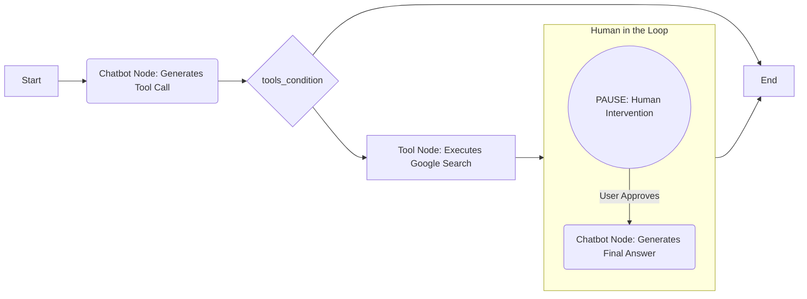

# Agent with Human Assistance: Adding a Human in the Loop

Our agent is getting smarter. It can use tools and remember past conversations. But what if it gets stuck, or what if we need to supervise its work before it takes an important action? Real-world applications often require a "human in the loop" – a way for us to guide, correct, or approve the agent's behavior.

Let's teach our agent to pause and ask for our help. This is a crucial step towards building reliable and collaborative AI systems.

## The Power of a Pause: Hardcoded Interrupts

LangGraph has a built-in mechanism for pausing the execution of a graph: **interrupts**. The simplest way to use them is to tell the graph to pause at a predetermined point in its flow.

!!! info "What is an Interrupt?"
    An interrupt is a directive you give to the compiled graph to pause its execution either **before** or **after** a specific node runs. When the graph is interrupted, it stops and returns control to you. You can then inspect its current state, modify it if needed, and decide when to resume the process.

This feature is perfect for human oversight. We can let the agent do its automated work (like searching with a tool) and then interrupt it just before it formulates the final answer, giving us a chance to review the information it found.

### Visualizing the New Flow

With a hardcoded interrupt, our agent's process will look a little different. After the tool runs, the graph will pause and wait for our signal to continue.



## Implementing a Hardcoded Interrupt

We want our agent to do the following:

1.  Receive our question.
2.  Decide to use the Google Search tool.
3.  Execute the search and get the results.
4.  **Pause** and wait for our approval.
5.  Once approved, use the search results to generate the final answer.

To achieve this, we only need to make a small but powerful change to how we compile our graph. We'll tell it to `interrupt_before` running the `chatbot` node.

Why interrupt *before* the `chatbot` node? Because the `chatbot` node is responsible for two things: calling tools and generating the final response. By interrupting *before* this node runs a second time, we catch the agent right after it has come back from the `ToolNode` with fresh data, but just before it synthesizes that data into a final answer.

Here's the complete code. The core logic of our nodes remains untouched. The changes are all in the final section where we compile the graph and interact with it.

??? "Full Code"
    ```python title="agent_with_hardcoded_interrupt.py" hl_lines="47 52-66"
    import os
    import json
    from typing import Annotated, TypedDict

    from dotenv import load_dotenv
    from langchain_core.messages import ToolMessage, HumanMessage
    from langchain_core.tools import Tool
    from langchain_google_community import GoogleSearchAPIWrapper
    from langchain_google_genai import ChatGoogleGenerativeAI
    from langgraph.graph import StateGraph, END, START
    from langgraph.graph.message import add_messages
    from langgraph.prebuilt import ToolNode, tools_condition
    from langgraph.checkpoint.memory import MemorySaver

    # --- Standard Setup ---
    load_dotenv()

    class State(TypedDict):
        messages: Annotated[list, add_messages]

    llm = ChatGoogleGenerativeAI(model="gemini-2.5-flash")
    search = GoogleSearchAPIWrapper()
    google_search_tool = Tool(
        name="google_search",
        description="Search Google for recent results about current events.",
        func=search.run,
    )
    tools = [google_search_tool]
    llm_with_tools = llm.bind_tools(tools)

    # --- Node Definitions & Graph Assembly ---
    def chatbot(state: State):
        print("---CHATBOT---")
        return {"messages": [llm_with_tools.invoke(state["messages"])]}

    tool_node = ToolNode(tools)

    graph_builder = StateGraph(State)
    graph_builder.add_node("chatbot", chatbot)
    graph_builder.add_node("tools", tool_node)
    graph_builder.add_edge(START, "chatbot")
    graph_builder.add_conditional_edges("chatbot", tools_condition)
    graph_builder.add_edge("tools", "chatbot")

    # --- Add Memory and Interrupts ---
    memory = MemorySaver()
    # Compile the graph, interrupting before the "chatbot" node runs.
    graph = graph_builder.compile(
        checkpointer=memory,
        interrupt_before=["chatbot"], # 👈 The magic happens here!
    )

    config = {"configurable": {"thread_id": "user-456"}}

    # --- The Human-in-the-Loop Interaction ---
    user_input = "What's the latest news on the Mars rover?"
    # Start the graph, but it will pause before the final chatbot response
    graph.invoke({"messages": [("user", user_input)]}, config=config)

    # The graph is now paused. We can inspect its state.
    paused_state = graph.get_state(config)
    print("\n--- Graph Paused ---")
    print("Next step:", paused_state.next) # This will be ('chatbot',)
    print("Messages in current state:")
    # The last message is the result from our Google Search tool
    print(paused_state.values['messages'][-1])

    # Let the user decide to continue
    print("\nPress Enter to allow the agent to generate the final response...")
    input()

    # Resume the graph by invoking it with `None`. It will continue from where it left off.
    final_result = graph.invoke(None, config=config)

    print("\n--- Agent Finished ---")
    print(f"Assistant: {final_result['messages'][-1].content}")

    ```

## Running the Code: A Guided Tour

When you run this script, the interaction will be different. It won't complete in one go.

1.  **Initial Run & Tool Call**: The script starts, the `chatbot` node runs once and decides to call the `google_search` tool. The `ToolNode` executes the search.
2.  **The Interrupt**: The graph is about to run the `chatbot` node for the *second time* (to process the tool's output). Because we added `interrupt_before=["chatbot"]`, the execution stops here.
3.  **Inspection**: Your program now has control. Our code prints out the current state of the graph. You will see the `ToolMessage` containing the search results. This is your chance to review the data the agent is about to use.
4.  **Human Approval**: The script waits for you to press Enter. This simulates a human approving the process to continue.
5.  **Resuming Execution**: When you press Enter, we call `graph.invoke(None, config)`. The `None` input tells LangGraph to simply resume from its paused state. The `chatbot` node finally runs, processes the tool result, and generates the final answer.

Here's what the output will look like:

```text
---CHATBOT---

--- Graph Paused ---
Next step: ('chatbot',)
Messages in current state:
type='tool' id='...' name='google_search' content='[{"title": "Mars Rover - NASA Science", "link": "https://science.nasa.gov/mars-exploration/rovers/", ...}]'

Press Enter to allow the agent to generate the final response...
<-- YOU PRESS ENTER HERE -->
---CHATBOT---

--- Agent Finished ---
Assistant: The latest news on the Mars rover includes updates from NASA on the Perseverance and Curiosity rovers. You can find detailed information, including recent discoveries and images, on the official NASA Science Mars Exploration website.
```

## Advanced HIL: Interrupt and Command

The `interrupt_before` method is powerful, but it's static. The graph *always* pauses at the same point. What if we want the agent to *decide for itself* when it needs help?

We can achieve this by giving the agent a special "human review" tool. The agent can then call this tool whenever it's uncertain. Our application will see this special tool call, **Interrupt** the flow, and ask the user for a **Command** on how to proceed.

<div class="grid cards" markdown>
!!! tip "Interrupt (Agent-Initiated)"
    Instead of the system forcing a pause, the agent itself requests one. It does this by calling a tool specifically designed for human intervention. The tool call might contain a question like, "I've found three documents, which one is most relevant?"

!!! success "Command (User-Provided)"
    This is the user's response to the agent's interruption. It's not just a simple "continue" anymore. The user can provide a specific directive, like "Use the second document," or "Ignore the documents and search for something else." This command is then fed back into the agent's state, directly influencing its next action.
</div>

This pattern makes the collaboration feel much more natural and intelligent.

### How would this work in code?

While we won't build a full example here, let's look at the key changes you'd need to make.

1.  **Create a Human Review Tool**:
    First, you'd define a new tool. Crucially, its function is empty because the application code will intercept it. Its description is what guides the LLM to use it.

    ```python
    from langchain_core.tools import tool

    @tool
    def human_review(query: str):
        """
        Use this tool to ask the user a question for clarification or
        to get approval before performing a critical action.
        """
        # This function is a placeholder.
        # Our main application loop will handle the logic.
        pass
    ```

2.  **Update the Agent's Tools**:
    You would add this new tool to the list available to the LLM.

    ```python
    # tools = [google_search_tool]  <-- Before
    tools = [google_search_tool, human_review] # <-- After
    llm_with_tools = llm.bind_tools(tools)
    ```

3.  **Create an "Interrupt and Command" Loop**:
    Your application loop becomes more sophisticated. Instead of just invoking the graph once, you'd use a `for` or `while` loop with `graph.stream`. Inside the loop, you check if the agent tried to use the `human_review` tool.

    ```python
    # This is a simplified example of the interaction logic
    while True:
        # Stream events from the graph
        for event in graph.stream({"messages": [("user", user_input)]}, config):
            # Check the event stream for tool calls
            for key, value in event.items():
                if key == "chatbot":
                    last_message = value["messages"][-1]
                    # Did the chatbot call our human review tool?
                    if last_message.tool_calls and last_message.tool_calls[0]['name'] == 'human_review':
                        # INTERRUPT!
                        question_for_user = last_message.tool_calls[0]['args']['query']
                        print(f"\n--- HUMAN REVIEW REQUIRED ---")
                        print(f"Agent asks: {question_for_user}")
                        
                        # Get a COMMAND from the user
                        user_command = input("Your instruction: ")

                        # We need to add BOTH the tool call and the user's response (as a ToolMessage)
                        # back into the state to resume.
                        # This part requires more complex state management.
                        # ...
    ```

!!! success "A More Powerful Collaboration"
    By mastering both hardcoded interrupts and the more dynamic "Interrupt and Command" pattern, you've moved from building a simple automation to designing a true collaborative partner. You can now build agents that know when to act alone and, more importantly, know when to ask for help.