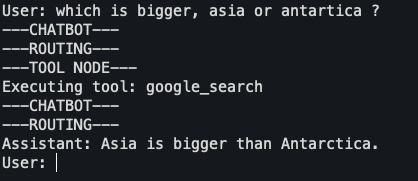
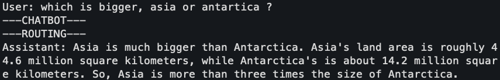

# Agent 007

Our agent is operational, but if we're being honest, it's a bit... trigger-happy. It has a shiny new gadget—the Google Search tool—and it wants to use it for *everything*.

This isn't a bug; it's a feature of how LLMs work. When you give them tools, they assume you *want* them to use those tools. Our goal in this section is to give our agent a "license to think"—to teach it discretion, upgrade its internal mechanisms, and understand why this graph-based approach is so powerful.

## 1. Taming the Eager Agent with a System Prompt

The simplest way to guide an LLM's behavior is to give it clear instructions. In the world of chat models, the most powerful instruction is the **system prompt**. Think of it as a top-secret directive that governs all of the agent's subsequent behavior.

We can instruct our agent to be conversational and to use its tools *only when necessary*.

Let's modify our main loop to include this new directive.

```python title="agent-007.py (Updated loop)"
# ... (all previous code remains the same)

# The new system prompt
system_prompt = (
    "You are a helpful AI assistant. "
    "Respond to the user's questions directly and conversationally. "
    "Only use the google_search tool if you cannot answer the question yourself."
)

# Let's run it!
while True:
    user_input = input("User: ")
    if user_input.lower() in ["quit", "exit", "q"]:
        print("Agent 007, signing off.")
        break
    
    # We now include the system prompt with every user message
    messages = [
        ("system", system_prompt),
        ("user", user_input)
    ]

    # Stream the events from the graph
    for event in graph.stream({"messages": messages}):
        for key, value in event.items():
            if key == "chatbot" and not value["messages"][-1].tool_calls:
                print(f"Assistant: {value['messages'][-1].content}")
```

#### The Result? A Smarter Agent.

By adding that simple `system` message, we've fundamentally changed the agent's behavior.

*   **Before:** `User:  which is bigger, asia or antartica ?` -> `---ROUTING---` -> `---TOOL NODE---` -> (Searches Google for " which is bigger, asia or antartica ?")
*   **After:** `User:  which is bigger, asia or antartica ?` -> `---ROUTING---` -> `Assistant: Asia is much bigger....`

Now, the agent uses its own vast knowledge for general conversation and only deploys its search gadget when faced with questions about recent events or specific data it wasn't trained on. It has learned discretion.

=== "Beginner Agent"
    
=== "Smarter Agent"
    

## 2.  Using LangGraph's Built-in Gadgets

In our first mission, we built our own `tool_node` function and a custom `route_tools` function. They worked perfectly, but LangGraph provides pre-built, standardized gadgets that are often more robust and make our code more declarative.

Let's refactor our code to use LangGraph's pre-built `ToolNode` and `tools_condition`.

*   **`ToolNode`**: Replaces our custom `tool_node` function. It's an optimized node that executes tools.
*   **`tools_condition`**: Replaces our custom `route_tools` function. It's a standard conditional edge that checks for tool calls.

Let's create a new file, `agent-007-smarter.py`, for this upgraded version, which is now significantly cleaner.

```python title="agent-007-smarter.py"
import os
import json
from typing import Annotated, TypedDict

from dotenv import load_dotenv
from langchain_core.tools import Tool
from langchain_google_community import GoogleSearchAPIWrapper
from langchain_google_genai import ChatGoogleGenerativeAI
from langgraph.graph import StateGraph, END, START
from langgraph.graph.message import add_messages
# Import the pre-built components
from langgraph.prebuilt import ToolNode, tools_condition

# --- Standard Setup (Same as before) ---
load_dotenv()

class State(TypedDict):
    messages: Annotated[list, add_messages]

llm = ChatGoogleGenerativeAI(model="gemini-1.5-flash")
search = GoogleSearchAPIWrapper()
google_search_tool = Tool(
    name="google_search",
    description="Search Google for recent results.",
    func=search.run,
)
tools = [google_search_tool]
llm_with_tools = llm.bind_tools(tools)

# --- Node Definitions (Now using pre-built) ---

def chatbot(state: State):
    print("---CHATBOT---")
    return {"messages": [llm_with_tools.invoke(state["messages"])]}

# Use the pre-built ToolNode
tool_node = ToolNode(tools)

# --- Graph Assembly (Notice the clean-up!) ---

graph_builder = StateGraph(State)
graph_builder.add_node("chatbot", chatbot)
graph_builder.add_node("tools", tool_node) # Register the pre-built tool node

graph_builder.add_edge(START, "chatbot")

# Our routing function is gone! We use the pre-built tools_condition.
graph_builder.add_conditional_edges(
    "chatbot",
    tools_condition, # Use the pre-built conditional router
    {"tools": "tools", END: END},
)
graph_builder.add_edge("tools", "chatbot")

graph = graph_builder.compile()

# --- Main Loop (Same as before, with system prompt) ---
# ... (The main loop is identical to the one above)
```
Look at that! We removed our custom `route_tools` function entirely. By using `ToolNode` and `tools_condition`, our code is now less about *how* to execute tools and route logic, and more about *declaring* the components and connecting them. This is the core benefit of a good framework.

## 3. Demystifying the "Magic": What `bind_tools` Really Does

It’s easy to look at a method like `.bind_tools()` and think there’s some hidden, complex magic happening. In reality, it's a powerful convenience that handles two tedious tasks for you: **prompt formatting** and **response parsing**.

It's not magic; it's an incredibly useful translation layer.

### On the Way In: Prompt Formatting

Without `.bind_tools()`, you would have to manually explain to the LLM—in exacting detail within the prompt—what tools are available and how to call them.

!!! question "What would a manual tool prompt look like?"
    You'd have to write something like this in your system prompt:

    "...You have access to the following tool:
    **Tool Name:** `google_search`
    **Tool Description:** `Search Google for recent results.`
    **Tool Schema:** `{'query': 'string'}`

    To use this tool, you MUST respond with a JSON object in the following format:
    ```json
    {
      "tool_name": "google_search",
      "tool_input": {
        "query": "the user's search query here"
      }
    }
    ```
    This is tedious to write and highly specific to the LLM you're using.

The `.bind_tools(tools)` method does this for you. It takes your nice Python `Tool` objects and automatically generates the precise, model-specific instructions, appending them to the prompt in the format the LLM expects.

### On the Way Out: Response Parsing

When the LLM decides to use a tool, it doesn't execute a Python function. It just returns text. That text might be a JSON object, like `{"tool_name": "google_search", ...}`.

Without the framework, you'd have to:
1.  Receive the raw text response from the LLM.
2.  Check if the text looks like a tool call.
3.  Use `json.loads()` to parse the string into a dictionary.
4.  Handle potential `JSONDecodeError`s if the LLM messes up the format.
5.  Manually call the correct Python function (`search.run`) with the arguments.

The framework handles all of this. It inspects the LLM's response, parses it cleanly and safely, and presents it to you as a beautiful, easy-to-use Python object: `AIMessage(..., tool_calls=[...])`. This lets you work with high-level objects instead of messy strings.

Think of it as an expert adapter. It translates your clean Python objects into the low-level language the LLM understands, and then translates the LLM's raw response back into clean Python objects for you to use.

## 4. Why Bother with a Framework?

At this point, if one still might wonder, "This is cool, but couldn't I just write this with a few `if/else` statements?" For this simple agent, yes. But the real power of LangGraph becomes apparent as soon as you want to add more capabilities.

Building an agent is like building a car. You *could* machine every bolt and weld the frame yourself. Or, you could start with a high-performance chassis, engine, and transmission, and focus your energy on designing the body, tuning the suspension, and creating a luxury interior.

**LangGraph is the high-performance chassis for your AI agent.**

!!! info "The Benefits of a Solid Framework"
    *   **Modularity:** Each node is a self-contained unit of logic. Want to add a new tool? Just add a new node and an edge. You don't have to refactor a giant `if/else` block.
    *   **Visualization & Debugging:** The graph structure isn't just an analogy; it's a reality. You can literally print or visualize the agent's path, making it far easier to understand *why* it made a certain decision.
    *   **Extensibility:** As agents become more complex, their flowcharts can grow. LangGraph is designed to handle this complexity gracefully.
    *   **State Management:** LangGraph handles the tedious work of passing the state between steps. You just define what the state looks like, and the framework ensures each node gets the information it needs.

## 5. Next on the Docket

We've built a solid, intelligent agent. But things are about to get a lot more interesting. In the upcoming sections, we'll explore:

*   **Complex State Management:** What if our agent needs to remember more than just the message history? 
*   **Human-in-the-Loop:** How can we pause the agent and ask for human confirmation before executing a critical step (like sending an email or deleting a file)?
*   **Modifying State:** We'll see how to do more than just append messages. We can update, delete, or transform data within our state as the agent works.
*   **Subgraphs:** For truly complex tasks, we can build graphs-within-graphs, allowing our agent to delegate complex sub-missions to specialized "mini-agents."

Stay tuned. The world of agentic AI is vast, and we've only just scratched the surface.