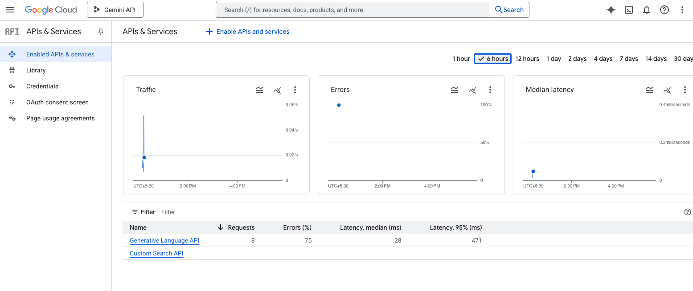

# 1. Setting Up Your Development Environment

Alright, let's roll up our sleeves and get our hands dirty! Before we can start building our amazing agent, we need to set up our workspace. This involves two main parts: getting the necessary credentials from Google Cloud and preparing our local Python environment.

## 1. Setting up Google Cloud

Our agent needs a way to talk to Google's services. To do this, we need to generate some "keys" that grant our application permission. Specifically, we'll need access to two services:

*   **Generative Language API:** This is how we'll access the powerful Gemini models.
*   **Custom Search API:** This will be our agent's tool for searching the web.

Let's get them set up.

!!! tip "No Billing Required"
    I have been using the Gemini Models and search api for 5-6 months now and haven't spent a penny on experimentation and haven't require to even add a Billing account to my current Gemini Project. The current free tier (as of 9/6/25 ) is very generous and will cover for most of one's usecase to get started on this journey. 

### a) Enable the APIs

First, we need to tell Google which services we intend to use.

1.  Navigate to the [Google Cloud Console](https://console.cloud.google.com/).
2.  Select an existing project or create a new one.
3.  In the search bar at the top, type "**APIs & Services**" and select it.
4.  Click on **"+ ENABLED APIS AND SERVICES"**.
5.  Search for and enable these two APIs one by one:
    *   `Generative Language API`
    *   `Custom Search API`

Once enabled, your "Enabled APIs & services" dashboard should look something like this :



### b) Create an API Key

Now that the services are enabled, we need a key to authenticate our requests.

1.  In the left-hand navigation pane of "APIs & Services", click on **Credentials**.
2.  Click **"+ Create credentials"** and select **"API key"** from the dropdown.
3.  A new API key will be generated for you. **Copy this key immediately** and save it somewhere safe for the next step.

Your credentials screen will now show your newly created key.


!!! danger "Protect Your API Key!"
    Treat your API key like a password. **Do not** share it publicly or commit it to a version control system like Git. We'll set up a secure way to use it in our project in just a moment.

### c) Create a Programmable Search Engine ID

The Google Custom Search tool requires one more piece of information: a **Search Engine ID**. This tells Google *what* to search (in our case, the entire web).

1.  Go to the [Programmable Search Engine control panel](https://programmablesearchengine.google.com/controlpanel/all).
2.  Click **"Add"** to create a new search engine.
3.  In the "What to search?" section, enable the **"Search the entire web"** option.
4.  Give your search engine a name (e.g., "LangGraph Tutorial Search") and click **"Create"**.
5.  After creation, you'll be taken to a dashboard. Click on **"Search engine ID"** to copy your ID (it usually starts with `cx`). Keep this ID handy; we'll need it soon.

## 2. Setting Up Your Local Python Project

With our keys in hand, it's time to set up our local project directory and the environment.


### a) Create the Project and <span class="hover-trigger"> Virtual Environment
  <span class="hover-box">
    A **virtual environment** is an isolated Python workspace. It allows us to install packages for a specific project without affecting other projects or the system-wide Python installation. It's a critical best practice for keeping dependencies clean and manageable.
  </span>
</span>

Open your terminal or command prompt and run the following commands:

```bash
# Create and navigate into your new project directory
mkdir langgraph-google-tutorial
cd langgraph-google-tutorial

# Create a Python virtual environment
python -m venv venv

# Activate the virtual environment
# On macOS/Linux:
source venv/bin/activate

```

You'll know it's working when you see `(venv)` at the beginning of your terminal prompt.

### b): Store Your Credentials Securely

Let's create a `.env` file to store our secret keys. This file will be read by our application but **must not** be committed to Git.

1.  Create a file named `.env` in your project's root directory.
2.  Add your keys to it like so:

```dotenv title=".env"
GOOGLE_API_KEY="YOUR_API_KEY_HERE"
GOOGLE_CSE_ID="YOUR_SEARCH_ENGINE_ID_HERE"
```
3. Create another file named `.gitignore` and add `.env` and `venv/` to it. This tells Git to ignore these files.

```text title=".gitignore"
# Environment variables
.env

# Virtual environment directory
venv/
```

### c) Install Initial Python Packages

Finally, let's install the Python libraries we'll need to get started. We'll add more as we go, but this is our starting set.

Run this command in your activated virtual environment:
[comment]: <> (check and update this list)
```bash
pip install langgraph langchain-google-genai langchain-google-community python-dotenv
```

Here’s a quick breakdown of what we just installed:

*   `langgraph`: The core framework for building our agent.
*   `langchain-google-genai`: The specific LangChain integration for Google's Gemini models.
*   `langchain-google-community`: The integration for Google Search and other community-maintained tools.
*   `python-dotenv`: A handy utility to load the variables from our `.env` file.

It's good practice to keep a `requirements.txt` file. Let's create one now.
[comment]: <> (TODO : add module versions)
```text title="requirements.txt"
langgraph
langchain-google-genai
langchain-google-community
python-dotenv
```

---

And that's it! Our setup is complete. We've enabled the necessary Google services, secured our keys, and prepared our local Python environment.

In the next section, we'll dive into the fun part: writing code and building our very first, simple LangGraph agent. Let's go!